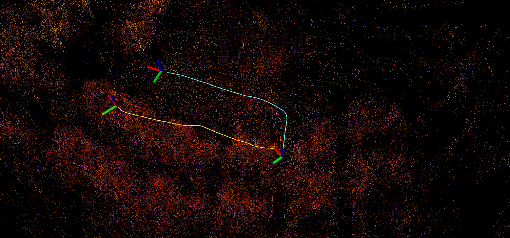
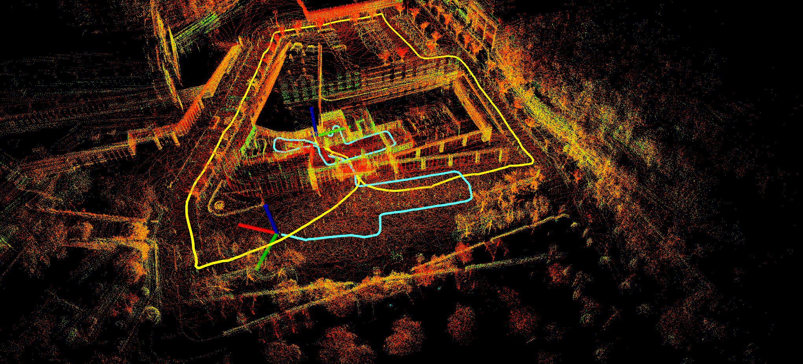
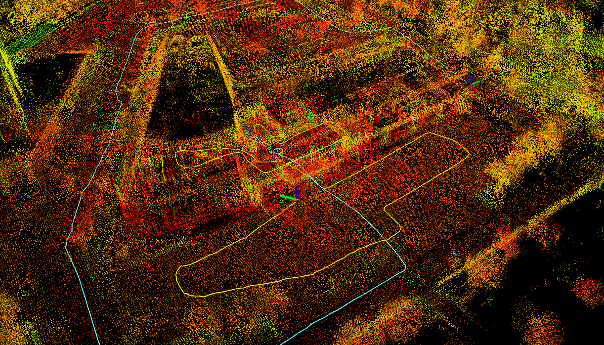

<div align="center">
  <h1>Liorf + Distributed SOLiD </h1>
  <a href=""></a>
  <a href=""></a>
  <a href=""></a>
  <a href=""></a>
  <a href=""></a>
  <br />
  <br />

  <p align="center">
    
  </p>

</div>

## :open_file_folder: What is Distributed SOLiD SLAM?
* Distributed SOLiD SLAM is a Distributed SOLiD-based LiDAR SLAM Framework, which is a modified version of [Liorf](https://github.com/YJZLuckyBoy/liorf) and [DiSCo-SLAM](https://github.com/RobustFieldAutonomyLab/DiSCo-SLAM). ([Scan Context](https://github.com/gisbi-kim/scancontext.git) &rightarrow; [SOLiD](https://github.com/sparolab/solid.git))
* The information exchange between robots is made through ROS-based communication. (More detailed in [here](https://github.com/sparolab/Distributed-SOLiD-SLAM/blob/main/msg/context_info.msg)!!)
* SOLiD, which is a lightweight descriptor enables fast communication between robots.

## :package: Dependencies

This package targets **ROS 2 Jazzy** (Ubuntu 24.04) and **ROS 2 Lyrical** (Ubuntu 26.04).

```bash
sudo apt install \
  ros-$ROS_DISTRO-pcl-conversions ros-$ROS_DISTRO-pcl-ros \
  ros-$ROS_DISTRO-tf2 ros-$ROS_DISTRO-tf2-ros ros-$ROS_DISTRO-tf2-eigen \
  ros-$ROS_DISTRO-tf2-geometry-msgs ros-$ROS_DISTRO-cv-bridge \
  ros-$ROS_DISTRO-gtsam ros-$ROS_DISTRO-libnabo ros-$ROS_DISTRO-rviz2 \
  libgeographiclib-dev libpcl-dev libopencv-dev libeigen3-dev
```

GTSAM and libnabo are pulled from the ROS 2 package index (`ros-$ROS_DISTRO-gtsam`,
`ros-$ROS_DISTRO-libnabo`); building them from source is no longer required.

## :hammer: Build

```bash
mkdir -p ~/ros2_ws/src && cd ~/ros2_ws/src
git clone <this repository> liorf
cd ~/ros2_ws
rosdep install --from-paths src --ignore-src -r -y
colcon build --cmake-args -DCMAKE_BUILD_TYPE=Release
source install/setup.bash
```

`mapOptmization.cpp` is template-heavy (GTSAM + PCL); on a machine with less
than ~4 GB of RAM per core, build with `MAKEFLAGS=-j2 colcon build ...` to avoid
the compiler being OOM-killed.

## HOW to run the package

1. Run the launch file (multi-robot):
  ```
    ros2 launch liorf run_liorf_multi.launch.py
  ```
  Single-robot dataset launches are also available:
  `run_kitti.launch.py`, `run_mulran.launch.py`, `run_M2DGR.launch.py`,
  `run_lio_sam_default.launch.py`, `run_lio_sam_ouster.launch.py`,
  `run_lio_sam_livox.launch.py`. Each accepts `rviz:=false` to skip RViz, and
  `robot:=<id>` to change the robot namespace prefix.

2. Play existing bag files:
  ```
    ros2 bag play your_bag       # ROS 2 bag
  ```
  ROS 1 bags need converting first, e.g. with
  [rosbags](https://gitlab.com/ternaris/rosbags): `rosbags-convert your_bag.bag`.

3. Save the map (per robot):
  ```
    ros2 service call /jackal0/liorf/save_map liorf/srv/SaveMap \
      "{resolution: 0.2, destination: /Downloads/LOAM}"
  ```

## :arrows_counterclockwise: ROS 2 port notes

* Interfaces were renamed to ROS 2 conventions: `liorf/CloudInfo`,
  `liorf/ContextInfo`, `liorf/SaveMap`. ROS 2 IDL forbids camelCase fields, so
  message fields are now snake_case (`imuRollInit` &rightarrow; `imu_roll_init`,
  `robotID` &rightarrow; `robot_id`, and so on).
* Parameter files live under the `/**: ros__parameters:` wildcard so every node
  picks up the same configuration regardless of the node name the launch file
  assigns. The `liorf:` / `mapfusion:` nesting is unchanged.
* A topic name that starts with `/` is treated as absolute and is no longer
  prefixed with the robot id (ROS 2 rejects the `robot//topic` that blind
  concatenation produced). This is what makes `mulran.yaml` work.
* `save_map` is now advertised per robot as `<robot_id>/liorf/save_map`;
  previously both robots advertised the same name in a multi-robot session.
* `imuPreintegration` hosts two nodes in one process, so the launch file remaps
  their names individually rather than with a process-wide `name=`.

 <p align='center'>
      
  </p>


**DiSCo-SLAM without Local SLAM enhancement:**
   prone to odometry drift in sudden environment changes
 <p align='center'>
      
  </p>


**After Local SLAM enhancement(with Liorf as LOCAL SLAM):**
   robust to drift and sudden environment changes
 <p align='center'>
      
  </p>


## :open_file_folder: What is Distributed SOLiD SLAM?
* Distributed SOLiD SLAM is a Distributed SOLiD-based LiDAR SLAM Framework, which is a modified version of [LIO-SAM](https://github.com/yeweihuang/LIO-SAM) and [DiSCo-SLAM](https://github.com/RobustFieldAutonomyLab/DiSCo-SLAM). ([Scan Context](https://github.com/gisbi-kim/scancontext.git) &rightarrow; [SOLiD](https://github.com/sparolab/solid.git))
* The information exchange between robots is made through ROS-based communication. (More detailed in [here](https://github.com/sparolab/Distributed-SOLiD-SLAM/blob/main/msg/context_info.msg)!!)
* SOLiD, which is a lightweight descriptor enables fast communication between robots.


## 
- Here we provide a distributed multi-robot SLAM example for 3 robots, intended for use with the two datasets provided below.
- Code from [Scan Context](https://github.com/irapkaist/scancontext) is used for feature description.
- We use code from [PCM](https://github.com/lajoiepy/robust_distributed_mapper/tree/d609f59658956e1b7fe06c786ed7d07776ecb426/cpp/src/pairwise_consistency_maximization) 
for outlier detection.
  
## Datasets

- [The Park Dataset](https://drive.google.com/file/d/1-2zsRSB_9ORQ9WQdtUbGdoS4YXU3cBQt/view?usp=sharing)
- [KITTI 08 Dataset](https://drive.google.com/file/d/1U6z_1VHlPJa_DJ2i8VwxkKLjf5JxMo0f/view?usp=sharing)

To run against a different dataset, point the launch file at the matching
parameter file in `config/` (each `run_*.launch.py` selects one), or pass your
own with the `params` argument of `launch/include/module_loam.launch.py`.
DiSO FEATURES
---------------------------------------------------------------------------------------------------------------------------------------------------
- Now utilizes G-ICP for mapFusion node, for better map-to-map matching

- republish of map topics for 3rd-party application requiring map application


LIORF FEATURES
---------------------------------------------------------------------------------------------------------------------------------------------------
# New Feature
------------------- Update Date: 2022-11-20 -------------------
- This version has removed the feature extraction module, making it easier to adapt to different lidars;
  
- Support 'robosense' lidar and Mulran datasets, make the following changes in "*.yaml":
  - sensor: “robosense” or sensor: “mulran”

- Support 6-axis IMU, make the following changes in "*.yaml":
  - imuType: 0 # 0: 6-axis IMU, 1: 9-axis IMU

- Support low frequency IMU（50HZ、100HZ）, make the following changes in "*.yaml":
  - imuRate: 500

------------------- Update Date: 2022-12-13 -------------------
- Re-derivation the LM optimization, don't need coordinate transformation.

------------------- Update Date: 2022-12-24 -------------------
- Modified gps factor, no longer depending on the 'robot_localization' package, and make it easier to adapt to different gnss device(RTK/GPS).

- The gps factor is modified to make it easier to adapt to gnss devices with different frequencies(10HZ~500HZ).

---------------------------------------------------------------------------------------------------------------------------------------------------


## For fusion gps factor
- Make sure your gnss topic type is 'sensor_msgs::NavSatFix';

- Modify 'gpsTopic' paramter in '*.yaml' with yourself gnss topic;
  ```
    gpsTopic: "gps/fix"    # GPS topic
  ```
- If you want to use liorf with integrated gps factor in kitti dataset, you can use the modified python script in "config/doc/kitti2bag" to obtain high-frequency gps data(Rate: 100HZ, Topic: '/gps/fix/correct'). About how to use "kitti2bag.py", please refer to [doc/kitti2bag](https://github.com/TixiaoShan/LIO-SAM/tree/master/config/doc/kitti2bag).


## Issues

  - **Zigzag or jerking behavior**: if your lidar and IMU data formats are consistent with the requirement of LIO-SAM, this problem is likely caused by un-synced timestamp of lidar and IMU data.

  - **Jumpping up and down**: if you start testing your bag file and the base_link starts to jump up and down immediately, it is likely your IMU extrinsics are wrong. For example, the gravity acceleration has negative value.

  - **mapOptimization crash**: it is usually caused by GTSAM. Install `ros-$ROS_DISTRO-gtsam` as described above. More similar issues can be found [here](https://github.com/TixiaoShan/LIO-SAM/issues).

  - **imuPreintegration aborts with an "Indeterminant linear system" or "dt <= 0"**: the IMU stream reaching the node has duplicate or out-of-order timestamps. Check that only one publisher is feeding `imuTopic` and that the bag's IMU timestamps increase monotonically.

  - **gps odometry unavailable**: it is generally caused due to unavailable transform between message frame_ids and robot frame_id (for example: transform should be available from "imu_frame_id" and "gps_frame_id" to "base_link" frame. Please read the Robot Localization documentation found [here](https://docs.ros.org/en/ros2_packages/rolling/api/robot_localization/preparing_sensor_data.html).


